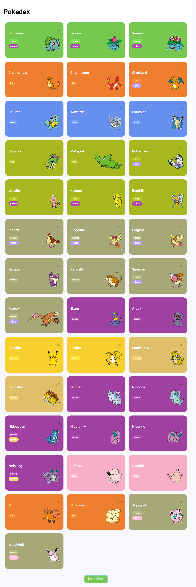

# Pokedex responsivo
 
Criado uma página pokedex totalmente responsiva para atividade da NTT DATA - Dio.

 ## Instalação:

`npm install http-server` 

#### Sequência para criar o projeto

- Utilizado api pública do pokedex  
  _https://pokeapi.co/api/v2/pokemon?offset=0&limit=5_ 
 
## Pré-visualização: [pokedex](https://js-developer-pokedex-one.vercel.app/)

